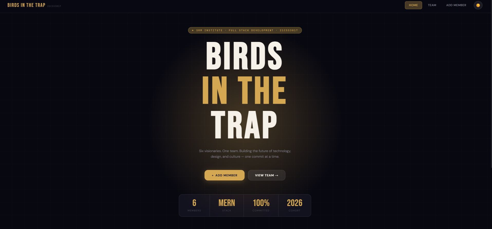
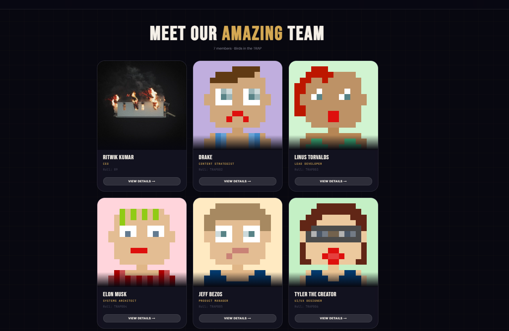
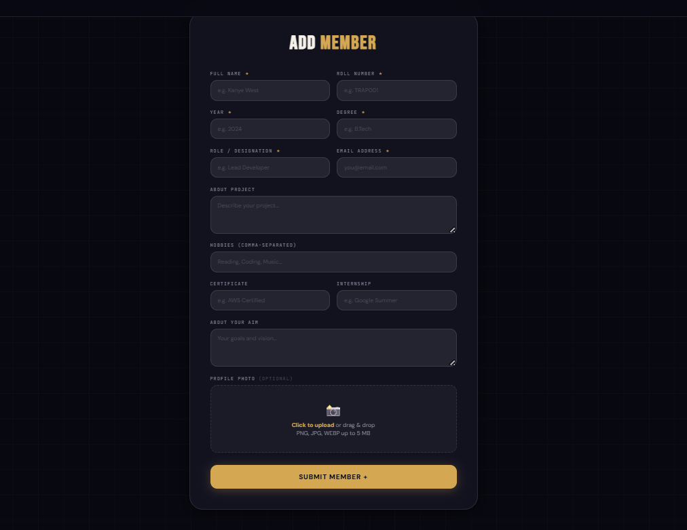
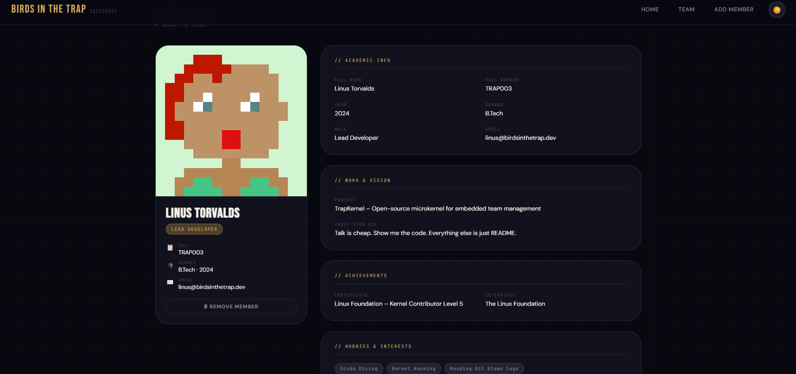

<div align="center">

```
██████╗ ██╗██████╗ ██████╗ ███████╗
██╔══██╗██║██╔══██╗██╔══██╗██╔════╝
██████╔╝██║██████╔╝██║  ██║███████╗
██╔══██╗██║██╔══██╗██║  ██║╚════██║
██████╔╝██║██║  ██║██████╔╝███████║
╚═════╝ ╚═╝╚═╝  ╚═╝╚═════╝ ╚══════╝

██╗███╗   ██╗    ████████╗██╗  ██╗███████╗    ████████╗██████╗  █████╗ ██████╗
██║████╗  ██║    ╚══██╔══╝██║  ██║██╔════╝    ╚══██╔══╝██╔══██╗██╔══██╗██╔══██╗
██║██╔██╗ ██║       ██║   ███████║█████╗         ██║   ██████╔╝███████║██████╔╝
██║██║╚██╗██║       ██║   ██╔══██║██╔══╝         ██║   ██╔══██╗██╔══██║██╔═══╝
██║██║ ╚████║       ██║   ██║  ██║███████╗        ██║   ██║  ██║██║  ██║██║
╚═╝╚═╝  ╚═══╝       ╚═╝   ╚═╝  ╚═╝╚══════╝        ╚═╝   ╚═╝  ╚═╝╚═╝  ╚═╝╚═╝
```

# 🦅 Birds in the TRAP
### Student Team Members Management Application

**Course:** 21CSS301T – Full Stack Development &nbsp;|&nbsp; **Assessment:** CLAT-2 &nbsp;|&nbsp; **Batch:** 2024


</div>

---

## 📸 Screenshots

> Replace the placeholders below with actual screenshots once the app is running.

| Home Page | View Members |
|-----------|-------------|
|  |  |

| Add Member | Member Details |
|-----------|---------------|
|  |  |


---

## 🏗 Project Structure

```
birds-in-the-trap/
├── backend/
│   ├── models/
│   │   └── Member.js          # Mongoose schema
│   ├── routes/
│   │   └── members.js         # REST API routes
│   ├── uploads/               # Uploaded profile images
│   ├── server.js              # Express entry point
│   ├── seed.js                # Seed DB with sample members
│   ├── .env.example           # Environment variable template
│   └── package.json
│
├── frontend/
│   ├── public/
│   │   └── index.html
│   └── src/
│       ├── components/
│       │   └── Navbar.jsx     # Fixed navbar with theme toggle
│       ├── pages/
│       │   ├── Home.jsx       # Landing page
│       │   ├── AddMember.jsx  # Add member form
│       │   ├── ViewMembers.jsx# Members grid
│       │   └── MemberDetails.jsx # Single member profile
│       ├── App.jsx            # Router + theme context
│       ├── index.css          # Global design system / CSS vars
│       └── index.js
│
├── .gitignore
└── README.md
```

---

## 👥 The Roster – Birds in the TRAP

| # | Name | Role | Roll |
|---|------|------|------|
| 1 | Kanye West | Creative Director | TRAP001 |
| 2 | Drake | Content Strategist | TRAP002 |
| 3 | Linus Torvalds | Lead Developer | TRAP003 |
| 4 | Elon Musk | Systems Architect | TRAP004 |
| 5 | Jeff Bezos | Product Manager | TRAP005 |
| 6 | Tyler the Creator | UI/UX Designer | TRAP006 |

---

## ⚙️ Tech Stack

| Layer | Technology |
|-------|-----------|
| Frontend | React 18, React Router v6, Axios |
| Backend | Node.js, Express 4 |
| Database | MongoDB (Mongoose ODM) |
| Styling | Custom CSS (liquid glass, CSS variables, dark/light mode) |
| File Upload | Multer |
| Dev Tools | VS Code, MongoDB Compass, Nodemon |

---

## 🚀 Installation & Setup

### Prerequisites

Make sure the following are installed on your machine:

- [Node.js](https://nodejs.org/) v18 or higher
- [MongoDB](https://www.mongodb.com/try/download/community) Community Edition (running locally)  
  _or_ a free [MongoDB Atlas](https://www.mongodb.com/atlas) cluster

---

### 1. Clone the repository

```bash
git clone https://github.com/<YOUR_USERNAME>/birds-in-the-trap.git
cd birds-in-the-trap
```

---

### 2. Backend Setup

```bash
cd backend

# Install dependencies
npm install

# Create your .env file from the example
cp .env.example .env
```

Edit `.env`:

```env
PORT=5000
MONGO_URI=mongodb://localhost:27017/birdsinthetrap
```

> For MongoDB Atlas, replace `MONGO_URI` with your Atlas connection string.

**Start the backend:**

```bash
# Development (auto-restart on save)
npm run dev

# Production
npm start
```

The server will start at **http://localhost:5000**

**Optional – Seed the database with sample members:**

```bash
npm run seed
```

This populates 6 pre-built team members (Kanye, Drake, Linus, Elon, Jeff, Tyler).

---

### 3. Frontend Setup

Open a new terminal:

```bash
cd frontend

# Install dependencies
npm install

# Start the React development server
npm start
```

The app will open at **http://localhost:3000**

> The `"proxy": "http://localhost:5000"` field in `frontend/package.json` routes all API calls through the backend automatically.

---

## 🔌 API Endpoints

Base URL: `http://localhost:5000`

| Method | Endpoint | Description |
|--------|----------|-------------|
| `GET` | `/api/members` | Retrieve all team members |
| `GET` | `/api/members/:id` | Retrieve a single member by ID |
| `POST` | `/api/members` | Add a new member (multipart/form-data) |
| `PUT` | `/api/members/:id` | Update a member |
| `DELETE` | `/api/members/:id` | Remove a member |
| `GET` | `/uploads/:filename` | Serve uploaded profile images |

### Testing in Browser

Open your browser and visit:

```
# All members (pretty-printed JSON)
http://localhost:5000/api/members

# Single member (replace ID with actual MongoDB _id)
http://localhost:5000/api/members/64f3a2b1c9e1234567890abc
```

### Sample POST Body (form-data)

```
name          → Kanye West
roll          → TRAP001
year          → 2024
degree        → B.Tech
role          → Creative Director
email         → ye@birdsinthetrap.dev
project       → DONDA OS
hobbies       → Architecture, Fashion, Music Production
certificate   → Grammy Award
internship    → Adidas Yeezy Division
aboutYourAim  → To be the greatest creative of all time
image         → [file upload]
```

### Sample JSON Response

```json
[
  {
    "_id": "64f3a2b1c9e1234567890abc",
    "name": "Kanye West",
    "roll": "TRAP001",
    "year": "2024",
    "degree": "B.Tech",
    "role": "Creative Director",
    "email": "ye@birdsinthetrap.dev",
    "project": "DONDA OS – AI-driven music composition platform",
    "hobbies": "Architecture, Fashion Design, Music Production",
    "certificate": "Grammy Award in Creative Excellence",
    "internship": "Adidas Yeezy Division",
    "aboutYourAim": "To be the greatest creative of all time",
    "image": null,
    "imageUrl": "https://api.dicebear.com/9.x/pixel-art/svg?seed=KanyeWest",
    "createdAt": "2024-04-21T10:30:00.000Z",
    "updatedAt": "2024-04-21T10:30:00.000Z"
  }
]
```

---

## 🎨 Features

- **4 Pages** — Home, Add Member, View Members, Member Details
- **Liquid Glass UI** — `backdrop-filter: blur` cards throughout
- **Dark / Light Mode Toggle** — Persistent across pages via React Context
- **Image Upload** — Drag & drop or click to upload profile photos (stored in `uploads/`)
- **Form Validation** — Required fields, email format check, real-time error display
- **CRUD Operations** — Add and delete members from the UI
- **Seed Script** — Pre-populate DB with 6 famous team members instantly
- **Responsive** — Works on mobile, tablet, and desktop
- **Bebas Neue** display font for that editorial impact
- **JetBrains Mono** for technical labels and metadata

---


```

---


---

<div align="center">
  <sub>Built by RITWIK KUMAR(RA2311027010089)</sub>
    
</div>
